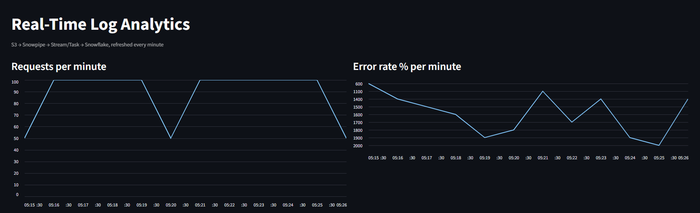
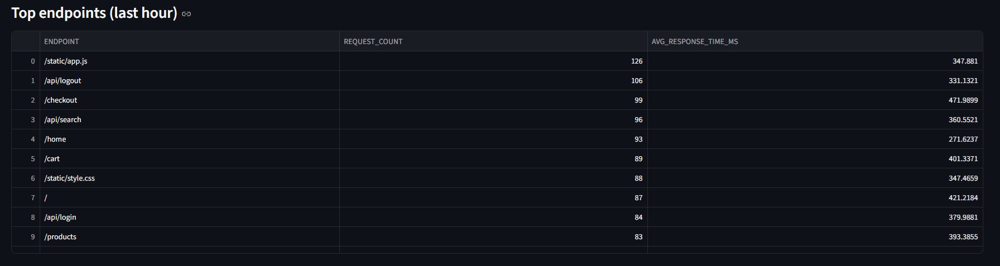
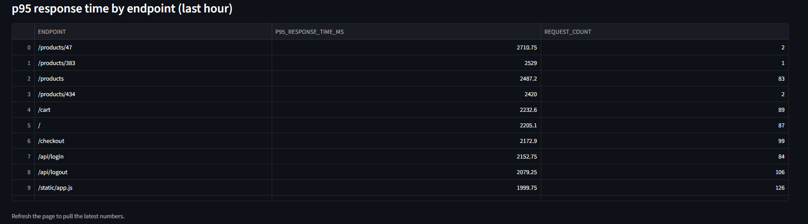

# Real-Time-ish Log Analytics Pipeline (AWS S3 → Snowflake)

A small, event-driven data pipeline that ingests simulated web server
logs, auto-loads them into Snowflake with Snowpipe, incrementally
transforms them with a Stream + Task, and surfaces aggregates via SQL
views (with an optional Streamlit dashboard).

## Architecture

```
Python log generator (faker)
        |  writes JSON-lines batches every N seconds
        v
   AWS S3 bucket (raw zone)
        |  S3 event notification -> SQS
        v
   Snowpipe (auto-ingest)
        v
   Snowflake RAW_LOGS table (VARIANT)
        |  Stream (change capture)
        v
   Task (runs every 1 min) -> flattens JSON
        v
   Snowflake LOGS_CLEAN table (typed columns)
        |
        v
   Aggregate views (traffic/min, error rate, top endpoints, p95 latency)
        |
        v
   Streamlit dashboard (optional)
```

## Why this project

- **Event-driven ingestion**, not a one-off batch load — shows you
  understand ingestion patterns beyond `COPY INTO` from a static file.
- **Least-privilege IAM** — the generator can only `PutObject`,
  Snowflake can only read; nothing has blanket bucket access.
- **Streams + Tasks** for incremental processing instead of full
  reloads — a core SnowPro Core concept.

## Setup

### 1. AWS
1. Create an S3 bucket, e.g. `my-log-pipeline-bucket`.
2. Create an IAM role for Snowflake to assume, and a separate IAM
   user/role for the generator, using `infra/iam_policy.json` as a
   starting point (update the bucket name and role ARNs).
3. Leave the S3 event notification step for after you've created the
   Snowflake pipe (step 2 below tells you what ARN to use).

### 2. Snowflake
Run the SQL files in order:
1. `snowflake/01_stage_and_pipe.sql` — creates the warehouse, database,
   storage integration, stage, raw table, and Snowpipe.
   - After running `CREATE STORAGE INTEGRATION`, run
     `DESC INTEGRATION LOG_PIPELINE_S3_INT;` and copy the
     `STORAGE_AWS_IAM_USER_ARN` / `STORAGE_AWS_EXTERNAL_ID` values into
     your AWS IAM role's trust policy.
   - After running `CREATE PIPE`, run `SHOW PIPES LIKE 'LOGS_PIPE';`
     and copy the `notification_channel` (an SQS ARN) into your S3
     bucket's event notification settings (send `s3:ObjectCreated:*`
     events under the `raw/` prefix to that queue).
2. `snowflake/02_stream_and_task.sql` — creates the stream, clean
   table, and the task that flattens JSON on a schedule.
3. `snowflake/03_aggregates.sql` — creates the analytical views.

### 3. Run the generator
```bash
pip install faker boto3
python generator/log_generator.py --interval 30 --batch-size 50 \
  --bucket my-log-pipeline-bucket
```

Watch data flow through:
```sql
LIST @LOG_PIPELINE_DB.RAW.LOGS_STAGE;
SELECT COUNT(*) FROM LOG_PIPELINE_DB.RAW.RAW_LOGS;
SELECT COUNT(*) FROM LOG_PIPELINE_DB.ANALYTICS.LOGS_CLEAN;
SELECT * FROM LOG_PIPELINE_DB.ANALYTICS.TRAFFIC_PER_MINUTE LIMIT 10;
```

### 4. Dashboard
```bash
pip install streamlit snowflake-connector-python pandas
SET SNOWFLAKE_ACCOUNT=xxxxx
SET SNOWFLAKE_USER=xxxxx
SET SNOWFLAKE_PASSWORD=xxxxx
streamlit run dashboard/app.py
```

## Dashboard preview

**Overview — traffic, error rate, top endpoints, and latency:**



**Top endpoints detail table:**



**P95 latency**


